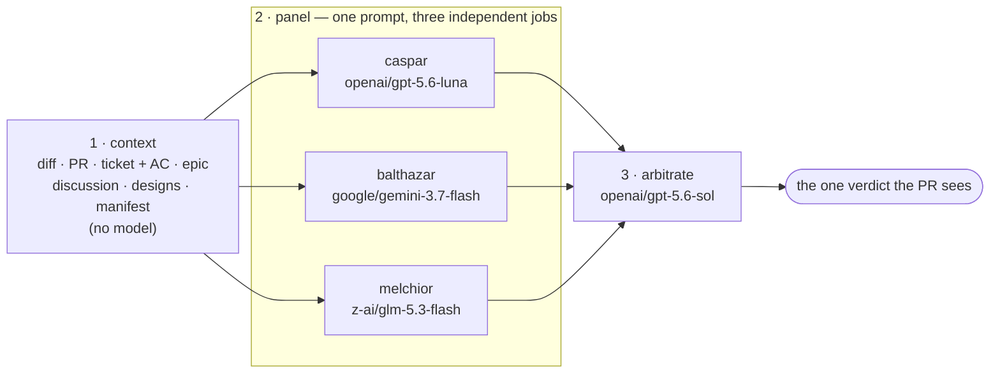

# .github

Org-wide GitHub defaults and shared reusable workflows.

## Reviews by BiggiePockets

`.github/workflows/biggiepockets-review.yml` is a **reusable** workflow that reviews a pull
request with a **panel** of independent auditors and an arbitrator:

1. **Context** — gathers everything the panel judges against and uploads it as one
   immutable handoff: the diff, the PR itself, the JIRA ticket and its acceptance criteria,
   that ticket's **epic**, the PR's existing discussion, and any **design references** found
   in those texts — plus a manifest saying which of them were actually available. **No model
   reviews the code here.**
2. **Panel** — three auditors named **caspar**, **balthazar**, and **melchior** each audit
   the change *independently*, running the *same* auditor prompt, and each writes its own
   verdict (`approve` / `request_changes`, plus a stated confidence and its blocking
   findings). Each reads the diff cold, greps for callers and tests, and factors in the
   existing PR discussion and the ticket's intent.
3. **Arbitration** — one arbitrator reads all three verdicts, verifies each blocking finding
   against the code, weighs the panel, and issues the single verdict that gets posted.

**Nothing reviews the diff ahead of the panel.** The auditors are the first thing to form an
opinion about the code, and stage 1 is deliberately model-free. A pre-pass that handed the
panel a list of findings would get three auditors agreeing about one model's opinion, which
is exactly the failure a panel exists to avoid — so CI asserts no prompt reads a
pre-existing findings file and the registry declares no prompt but the auditor's and the
arbitrator's.



The **BiggiePockets** service account then submits that `approve` / `request_changes` review
on the PR. If the PR has no `BIG-XXXXX` key in its title (or the ticket can't be fetched),
the review degrades gracefully to a diff-based review instead of failing.

**What makes the audits independent.** Each seat is a job of its own — `caspar`,
`balthazar`, `melchior`, each named for the seat and each written out in the workflow rather
than fanned out from a matrix. A seat runs on its own runner, can read only the stage-1
handoff, and never another seat's output. It writes its verdict to `audit-<seat>.json` and
uploads it; the arbitration job is the first and only place in the run where more than one
verdict exists together. So when two auditors disagree, they disagree because they judged the
code differently, not because one saw the other's answer.

Everything that differs between the three jobs lives in the job's `env` — the seat name and
its model — which leaves their `steps:` blocks byte-identical. That is load-bearing: a split
between seats is only evidence about the models if the harness around them is the same, and
three copies of a block drift one seat at a time. CI diffs the blocks and fails if they stop
matching, and fails too if the set of seat jobs stops matching the roster in
`prompts/registry.json`.

The seats run **different models** on the identical prompt (see *Models* below). That is the
point: with the prompt held fixed, a split between seats is signal about the change, whereas
three runs of one model would mostly agree trivially and leave the arbitrator nothing to
weigh.

**Arbitration weighs, it does not tally.** A blocking finding the arbitrator can confirm in
the code outweighs any number of approvals that missed it; one it can disprove is discarded
however confidently it was raised; and unanimity that the evidence doesn't support is
overruled with an explanation. The arbitrator may confirm or discard what the panel raised
but may not introduce a blocking issue no auditor found — it arbitrates rather than becoming
a fourth reviewer. The posted summary closes with a `Panel:` line recording how the seats
split and where the arbitrator overrode them.

**Retries.** Stage 1 uploads the reviewed commit's whole context as one short-lived
artifact; every later job downloads that immutable handoff, so all three auditors
judge the exact same commit even if the PR is pushed to mid-review. If a seat is rate-limited,
use **Re-run failed jobs** on the workflow run: GitHub re-runs only the failed seats, reusing
the context stage that already succeeded. A seat that produces
no valid verdict is recorded as failed rather than counted as an approval, and arbitration
requires a **majority of seats** to have reported — below that it fails loudly instead of
quietly downgrading to a one-reviewer review.

Requiring only a majority is what makes a tie possible: three binary verdicts can only land
3-0, 2-1, 1-2, or 0-3, but if one seat fails, arbitration runs over the two that reported and
those two can split 1-1. That is the case where the arbitrator decides alone, so it is tagged
`arbiter_followed_panel:no_majority` rather than scored as overriding a majority that never
existed. The alternative — demanding all three seats — would let one rate-limited seat fail
an entire review.

### What the panel is given

Stage 1 gathers context and nothing else — it never reads the diff to form a view of it. Each
source becomes one file in the handoff every seat downloads:

| File | What it holds |
| --- | --- |
| `context-manifest.json` | What was gathered, and which sources were unavailable and why |
| `pr.diff` | The diff of the reviewed commit against its base |
| `pr.json` | Title, body, labels, commit messages, and the touched files with line counts |
| `ticket.json` | The `BIG-XXXXX` ticket from the PR title: summary, description, acceptance criteria, status, type, and its parent's key |
| `epic.json` | That parent — where the wider goal usually lives, when a ticket's own description reads as a fragment |
| `conversations.json` | The PR's existing discussion: comments, inline review threads, prior reviews |
| `designs.json` | Design references found in all of the above: Figma and other design-tool links, screenshots, walkthrough videos, ticket attachments |

A source that isn't there is recorded as `{"available": false, "reason": …}` rather than
failing the review: a PR with no ticket, no epic and no designs is still reviewable, just with
less to judge intent against. The manifest exists so an auditor can tell *"there is no epic
for this work"* from *"the epic fetch failed"* — both otherwise read as silence, which is how
a review ends up judging intent against nothing and not saying so. The prompts require an
auditor to name context it did not have and what it could not judge without it.

Design links are **recorded, never followed**. The panel has no Figma credentials, and a code
review has no reason to pull design or member-facing content into a build artifact. What a
recorded link buys an auditor is the knowledge that a design exists for this work — the
difference between "no design was specified" and "a design was specified and I can't see it" —
and the prompts forbid treating a reference it can't open as a defect.

No handoff file carries an author, assignee or reporter: the panel judges the change, not who
wrote it, and leaving identities out keeps them off the artifacts and out of telemetry. The
PR discussion is the one exception, because attribution is what makes *"a human reviewer
objected and it was never resolved"* legible to the panel.

### Models

Every model an OpenRouter slug with a default pinned in the workflow, overrideable per repo
by setting the matching **Actions variable** (Settings → Actions → Variables) in the calling
repo. An unset or empty variable keeps the default. Stage 1 runs no model, so it has no entry.

| Stage | Variable | Default |
| --- | --- | --- |
| caspar | `MAGI_MODEL_CASPAR` | `openai/gpt-5.6-luna` |
| balthazar | `MAGI_MODEL_BALTHAZAR` | `google/gemini-3.7-flash` |
| melchior | `MAGI_MODEL_MELCHIOR` | `z-ai/glm-5.3-flash` |
| Arbitration | `ARBITER_MODEL` | `openai/gpt-5.6-sol` |

There is no fallback model. A seat listed in `prompts/registry.json` with no
`MAGI_MODEL_<SEAT>` of its own fails its own job with an explicit error, so adding a seat is
deliberately a three-part change: roster entry, job, model. A seat that quietly ran the same
model as another seat would be a panel that had lost a voice while still reporting three
verdicts — worse than a seat that fails and says why.

Changing a seat's model never touches the prompt — the auditor prompt is seat-agnostic by
construction, and CI asserts it.

The review logic lives centrally in this repo. Each consuming repo only adds a thin
**caller** workflow that owns the triggers and gating and delegates to this one.

### Installing it in a repo

Do this once per repo you want BiggiePockets to review.

#### 1. Install the Claude GitHub app

The auditor and arbitration stages use [`anthropics/claude-code-action`](https://github.com/anthropics/claude-code-action)
as their harness, pointed at OpenRouter model slugs.
Install the official [Claude GitHub app](https://github.com/apps/claude) for the organization
once; you do **not** need to reinstall it per repo. Model requests authenticate through
OpenRouter using the shared `OPENROUTER_API_KEY` described below, so no personal Claude Code
OAuth token is required.

#### 2. Add the caller workflow

Create `.github/workflows/biggiepockets-review.yml` in the target repo:

```yaml
name: BiggiePockets Code Review

# Thin caller for the org-wide reusable review workflow in BiggerPockets/.github.
# This file owns the triggers and gating; the review logic lives centrally.
on:
  pull_request:
    types: [review_requested]
  workflow_dispatch:
    inputs:
      pr:
        description: 'PR number to review'
        required: true
        type: string

# The reusable workflow's jobs need these scopes. Declare them explicitly so the
# caller works regardless of the repo's default token permissions.
permissions:
  contents: read
  pull-requests: read
  id-token: write

jobs:
  review:
    # React to a manual dispatch, or to BiggiePockets specifically being requested.
    if: >-
      github.event_name == 'workflow_dispatch' ||
      github.event.requested_reviewer.login == 'BiggiePockets'
    uses: BiggerPockets/.github/.github/workflows/biggiepockets-review.yml@main
    with:
      pr: ${{ github.event.pull_request.number || inputs.pr }}
      # The BiggerPockets/.github ref to resolve review prompts from. Defaults to `main`,
      # so callers tracking `@main` can omit it. If you pin the `uses:` ref above to a tag
      # or SHA, pass the matching ref here too — otherwise prompts silently track main.
      registry_ref: main
    secrets: inherit
```

#### 3. Make the secrets available

The reusable workflow consumes several secrets via `secrets: inherit`: credentials for the
AI review provider (`OPENROUTER_API_KEY`, shared by all three seats and arbitration), an
Atlassian email + API token to fetch the PR's JIRA ticket for
intent, and a personal access token for the BiggiePockets service account that submits the
review. Configure them as **organization secrets** (recommended — set once, available to
every repo) or as per-repo secrets if you prefer to scope them.

It also reports per-review traces to the `biggiepockets-review` app in Datadog LLM
Observability via `secrets.DATADOG_API_KEY`: the arbitrated verdict, how the panel split,
each seat's own verdict and confidence, timing per stage, prompt template and version
(tracked as prompts, see below), the model each stage ran, and the summary the arbitrator
wrote — so review quality is inspectable, not just counted. This
secret is optional; reviews still run and post normally without it, but no metrics are
reported.

The exact secret names each step expects are visible in the `env:` and `with:` blocks of
[`.github/workflows/biggiepockets-review.yml`](.github/workflows/biggiepockets-review.yml).

#### 4. Set workflow permissions

The reusable workflow's jobs need `pull-requests: read` and `id-token: write` (OIDC
authentication for `claude-code-action`). The caller YAML declares these in its
`permissions` block, but GitHub caps those declarations at whatever the repo's default
token setting allows. Repos set to **"Read repository contents"** (the restrictive
default) deny `id-token: write` regardless of what the YAML says — the workflow fails
with `startup_failure` before any job runs.

Go to **Settings → Actions → General → Workflow permissions** on the target repo and set:

- **"Read and write permissions"**
- **"Allow GitHub Actions to create and approve pull requests"** (checked)

#### 5. Give BiggiePockets access

The **BiggiePockets** service account must have access to the repo so it can be requested
as a reviewer and post the review. Add it as a collaborator (or via a team) with at least
write access.

### Using it

If your repo lists a review job as a **required status check**, the job names are `context`,
one per seat (`caspar`, `balthazar`, `melchior`), and `arbitrate`. Two of those changed: stage
1 was once named `codex`, and the seats were once matrix legs reported as `audit (caspar)` and
friends. A branch protection rule still requiring `codex` or `audit (…)` will block merges
forever, since no job by those names runs any more.

Once installed, trigger a review either way:

- **Request a review** — add **BiggiePockets** as a reviewer on the PR. The workflow fires
  on `review_requested` and only runs when BiggiePockets specifically is the requested
  reviewer.
- **On demand** — run the `BiggiePockets Code Review` workflow via **Actions →
  workflow_dispatch** and pass the PR number. (Available once the caller file is on the
  repo's default branch.)

### Prompt registry

The prompts are not inline in the workflow. They live in this repo under `prompts/` and are
resolved at runtime by `scripts/resolve-prompts.sh`:

```
prompts/
  registry.json                # which prompt runs at each stage + the panel seats
  magi-audit.md                # stage 2 prompt — every seat runs this one text (template)
  magi-arbitrate.md            # stage 3 prompt (template)
  _shared/{completeness,privacy,migration-data,perf,parsing,navigation}-rules.md  # shared rule blocks
```

- **Templates + shared blocks.** Each prompt references the shared rule blocks via
  `{{@prompts/_shared/<name>.md}}`, so one edit updates every prompt that enforces that
  rule. Prompts also resolve `{{PR}}`, `{{PROMPT_NAME}}`, `{{PROMPT_VERSION}}`, and
  `{{AUDITORS}}` (the seat list, which the arbitrator needs so a missing verdict reads as a
  gap rather than an absence).
- **One auditor prompt, three seats.** The resolver emits `auditor_prompt` **once** and
  every seat runs that same text — nothing in it is parameterized by seat. That is what
  makes a disagreement between seats meaningful: the seats are answering the same question,
  so the difference is the model and the judgment, not the wording. CI asserts the auditor
  prompt names no seat.
- **Content-derived versions.** `prompt_version` is a content hash of the template plus the
  shared blocks it includes — it changes only when that prompt's text changes, not per PR
  and not per seat. One `auditor_prompt_version` therefore covers all three audit spans, and
  Datadog LLM Obs can attribute quality to the exact prompt text that ran.
- **Panel seats.** `registry.json` lists the seats under `auditors`. That roster is what
  tells the arbitrator how many verdicts to expect, so a seat that failed reads as a gap
  rather than an absence. Each seat also has a job of its own in the workflow, which means
  adding or removing one is a change in both files — CI fails if they disagree. The resolver
  rejects a panel of fewer than two seats, duplicate seat names, and seat names that aren't
  safe as artifact names, file names, and env-var suffixes. Seat models are set in the
  workflow, never here (see *Models* above).
- **Prompt Tracking.** Every LLM span carries the prompt that produced it under
  `meta.input.prompt` — the registry template with its `{{PR}}`-style placeholders intact,
  plus the values that filled them as `variables`, plus `id`/`name`/`version`. Keeping the
  placeholders is what makes each prompt one tracked prompt in Datadog rather than a new
  template per PR, so the [Prompts view](https://app.datadoghq.com/llm/traces) shows call
  volume, latency, tokens, and a version diff per prompt, and any span can be replayed in
  the Playground with its exact template and variables. A version starts when the prompt
  text changes (a Roll), since `version` is the same content hash reported as a tag.
- **Datadog.** Each review is one trace: a `biggiepockets.review` root with one
  `magi.audit.<seat>` child per seat and one `magi.arbitrate` child — the shape of the
  diagram above, minus stage 1, which runs no model and so has no LLM span.

  A seat's own verdict, confidence, model, and blocking-finding count live on that seat's
  span and on `auditor_verdict.<seat>` / `auditor_confidence.<seat>` /
  `auditor_model.<seat>` / `auditor_blocking_findings.<seat>` tags, so a disagreement is
  queryable without opening the run. Panel-level tags carry the outcome: `verdict` (what was
  posted), `panel_agreement` (`unanimous_approve` / `unanimous_request_changes` / `split`),
  `panel_approve`, `panel_request_changes`, `panel_seats_reporting` /
  `panel_seats_declared`, and `arbiter_followed_panel` (`true` / `false` / `no_majority`).
  A stable `run_id` (`repo-pr-runid`) joins offline evals and panel ratings to the exact
  review.

  **The two numbers worth watching** are `panel_agreement` and `arbiter_followed_panel`.
  If the panel is nearly always unanimous, the seats aren't adding independent information
  and the extra seats aren't earning their cost — diversify the models. If the arbitrator
  never departs from the majority it is a vote counter, and if it always does it is ignoring
  the panel; either way the arbitration prompt is the thing to fix.

  Spans carrying `arm`, `arm_role`, `arm_agreement`, `experiment_verdict`, or
  `label_assignment` tags came from the earlier A/B setup and are not comparable to these;
  neither are spans carrying `codex_model` or a `codex.review` child, which came from a
  pre-panel first pass that no longer runs. Exclude both when querying.

**Registry operations:**

- **Roll** — edit a prompt or shared-rule file; its content-derived `prompt_version` bumps.
- **Apply** — point `auditor_prompt` or `arbiter_prompt` at a different
  stored prompt (no version change). Callers tracking `@main` pick the change up on their
  next run. A caller that pins `uses:` to a tag or SHA needs BOTH that `@ref` and its
  `registry_ref` input bumped in lockstep — Apply owns that ref-bump explicitly.
- **Seat** — add or remove a name in `auditors`. A new seat also needs a
  `MAGI_MODEL_<SEAT>` default in the workflow (or that repository variable set); without
  one its matrix leg fails rather than silently doubling up on another seat's model.

A `validate-prompts.yml` workflow guards the registry: it fails a PR if a template has
dangling includes, `registry.json` references a missing prompt, the auditor prompt names a
seat, the arbitrator prompt doesn't name every seat, the seat list isn't a matrix-ready JSON
array of at least two safe unique names, a broken registry resolves instead of erroring, the
resolver isn't deterministic for a fixed PR, or a shared-rule edit doesn't bump versions.
